# Индивидуальной работа

### Содержание 

[Инструкция по запуску проекта](#i)

[Задание](#task1)  
[Выполнение](#do)  
[Главная страница](#main)  
[Подключение к базу данных](#bd)
[Создание продукта](#add)
[Обработка данных продукта](#obrab)
[Отображение продукта](#temp)
[Вывод аккаунтов пользователей](#accounts)
[Скрипт для завершения сессии](#session)
[Страница регистрации](#reg)
[Вывод](#вывод)  
[Источники](#источники)  

### <a name="i"> Инструкция по запуску проекта</a>

1. **Клонируйте репозиторий**

   Сначала склонируйте репозиторий на свой компьютер с помощью команды:

 - [Индивидуальная работа](https://github.com/Tasha290929/IDphp)

2. **Установите PHP**

   Убедитесь, что на вашем компьютере установлен PHP и Composer. Если их нет, вы можете скачать их с официальных веб-сайтов:

   - [Скачать PHP](https://www.php.net/downloads)

3. **Запустите веб-сервер**

   Запустите веб-сервер PHP в директории проекта:

    ```bash
    php -S localhost:8080
    ```

4. **Откройте проект в браузере**

   Откройте ваш любимый веб-браузер и перейдите по адресу 
   
   - [Индивидуальная работа](https://localhost:8080)

   Теперь вы должны увидеть ваш проект в браузере.

*ИЛИ можно запустить через OpenServer*

2. **Установите OpenServer**

Установите OpenServer с официального сайта

3. **Запустите OpenServer**

Нажмите на скаченное приложение, появится красный флажок в области уведомлений Windows. Нажмите на флажок далее выберите зеленый флажок что бы запустить приложение.

4. **Откройте проект в браузере**

Нажмите на флажок -> мои проеты и выберите нужный проект. 

**!ВАЖНО!**

Что бы запустить проект через OpenServer его нужно сохранить в папке  `OpenServer` -> `domains` 


## <a name="task1"> Задание </a>

В качестве «исследовательского проекта» в рамках дисциплины «Вебпрограммирование» предлагается разработать веб-приложение (веб-сайт, rest
api, мессенджер-бота) средней сложности, содержащее функционал,
реализованный на стороне сервера.

 Для реализации индивидуального проекта могут быть использованы любые
fronend и backend веб-технологии.

## <a name="do"> Выполнение </a>
**Мой проект состоит из нескольких страниц**

<a name="main"> __Начнем с главной страницы__ </a>

* `index.php`

1. Обьявляем переменные для стилей и картинок, поключаемся к базе данных и заголовочной части сайта.

```php
$css1 =  "./css/home.css";
$css2 =  "./css/app.css";
$img = "./img/";

$app = "./app/";

require_once("./blocks/header.php");
require_once("./blocks/db.php");
```

Получаем данные о всех продуктах из базы данных
```php
$sql = "SELECT * FROM Product";
$result = $conn->query($sql);
```

Далее реализована главная страница, она состоит из нескольких частей:

1.1 Титульная страница проекта (первое что видит пользователь заходя на сайт)

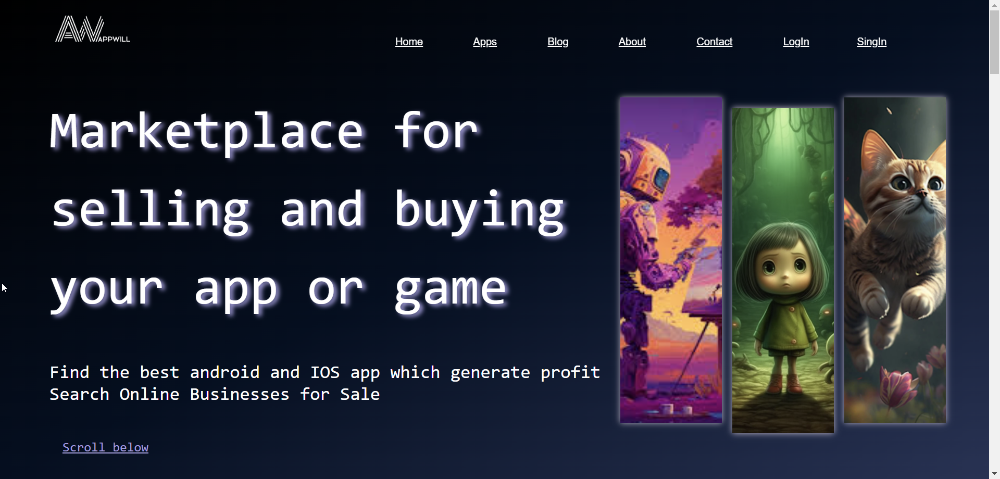

1.2 Лента с ссылками-картинками на продукты 

Картинки и названия выводятся из базы данных и формируется код html для красивого вывода картинок.

```php
         $sql = "SELECT * FROM Product ORDER BY ProductID DESC LIMIT 5";
         $result = $conn->query($sql);
         
         if ($result->num_rows > 0) {
             // Инициализация переменной для подсчета добавленных продуктов и остановки вывода после 5 продуктов
             $added_products = 0;
             // Создание массива для хранения HTML-кода блоков с продуктами
             $product_blocks = array();
         
             // Вывод иконок продуктов в порядке добавления
             while ($row = $result->fetch_assoc()) {
                 // Формирование HTML-кода для каждого продукта
                 $product_block = '<a href="product_template.php?id=' . $row['ProductID'] . '" class="game g-' . ($added_products % 5 + 1) . '" style="--img: url(\'/uploads/' . $row['Icon'] . '\');" data-text="' . $row['Name'] . '" target="_blank"></a>';
                 // Добавление HTML-кода продукта в массив
                 $product_blocks[] = $product_block;
                 // Увеличение счетчика добавленных продуктов
                 $added_products++;
             }
         
             // Вывод HTML-кода строк с продуктами
             foreach ($product_blocks as $product_block) {
                 echo $product_block;
             }
         } else {
             echo "No products to display.";
         }
```

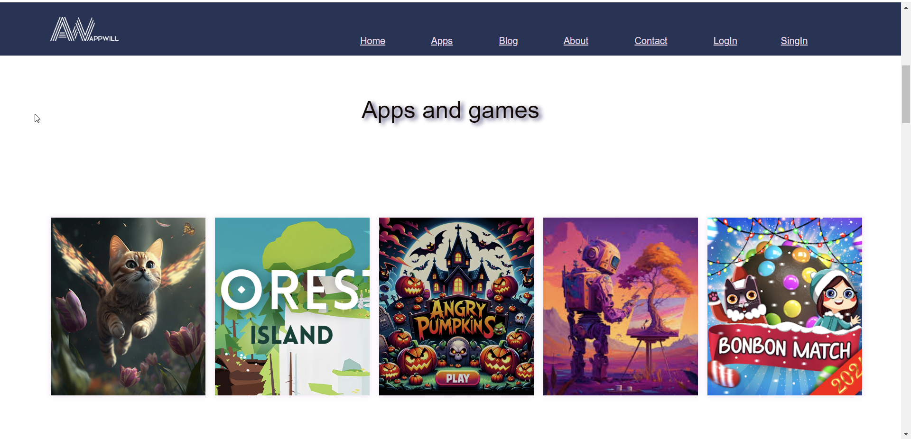

1.3 Сылка на страницу, где можно посмотреть все продукты в продаже и поиск по странице реализованная при помощи метода GET скрипт для поиска находится в файле `search_results`.

```php
    <div class="search-container">
        <form action="search_results.php" method="GET">
            <input type="text" placeholder="Search.." name="query">
            <input type="submit" value="Search">
        </form>
    </div>
</div>
```

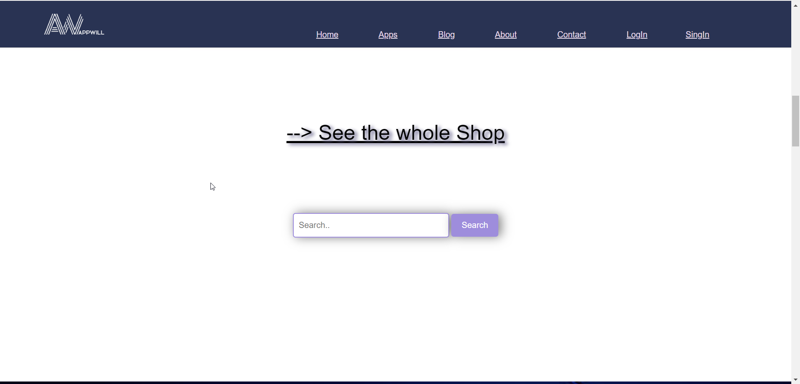

1.4 Раздел о компании и что стоит знать покупателю


1.5 Подключение файла,который содержит нижнюю часть страницы 

```php
<?php require_once("./blocks/footer.php");
```
В footer использован JS для отображения даты и времени.

```js
function updateDateTime() {
                            var currentDate = new Date();
                            var options = {
                                weekday: 'long',
                                year: 'numeric',
                                month: 'long',
                                day: 'numeric',
                                hour: 'numeric',
                                minute: 'numeric',
                                timeZoneName: 'short'
                            };
                            var formattedDateTime = currentDate.toLocaleDateString('en-US', options);
                            document.getElementById("currentDateTime").innerHTML = formattedDateTime;
                        }
                        updateDateTime();

                        setInterval(updateDateTime, 1000);
```
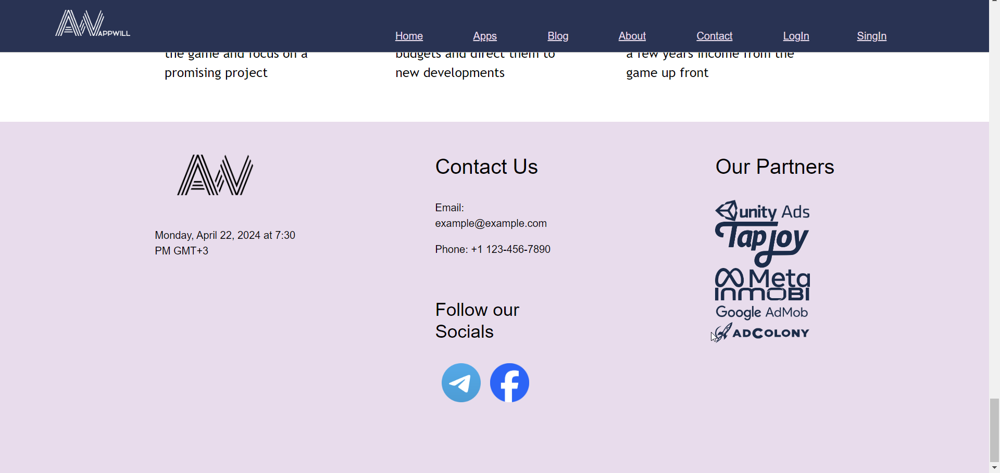

1.6 `header.php` содержит скрипт для отображения меню на сайте страницы 

Я поключала этот файл во все страницы поэтому при помощи php в `header.php` я переключаю стили и некоторые параметры меню если пользователь зарегистрирован 

```php
  session_start();
                    // Проверяем, есть ли начатая сессия
                    if (isset($_SESSION['loggedin']) && $_SESSION['loggedin'] === true) {
                        // Если сессия начата (пользователь авторизован или зарегистрирован), выводим кнопку выхода
                        echo '<a href="./phplogin/logout.php" onclick="slowScroll(\'#top\')">Logout</a>';
                    } else {
                        // Если сессия не начата, выводим ссылки на страницы авторизации и регистрации
                        echo '<a href="../phplogin/athorization.html" onclick="slowScroll(\'#aboutt\')">LogIn</a>';
                        echo '<a href="../phplogin/register.html" onclick="slowScroll(\'#contact\')">SingIn</a>';
                    }
```
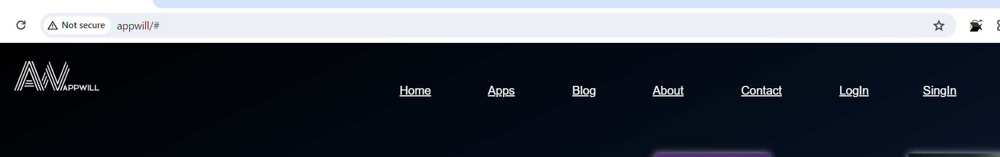

2. <a name="bd"> Скрипт для подключения к базе данных `bd.php` </a>

```sql
$dbname = "appwill"; 
$servername = "localhost";
$username = "root"; // Имя пользователя базы данных
$password = ""; // Пароль базы данных


// Создание подключения
$conn = @new mysqli($servername, $username, $password, $dbname);
if ($conn->connect_error) exit('Ошибка подключения BD');
$conn->set_charset('utf8');
```

3. <a name="add"> Страницу продукта можно создать через аккаунт админа `addproduct.php` </a>

3.1. Проверяем кто начал сессию если имя пользовател admin, то отправляем его на страницу добавления продуктов, если нет то на главную страницу. 

```sql
session_start();

if (!isset($_SESSION['loggedin']) || $_SESSION['name'] !== 'admin') {
    header('Location: index.php');
    exit;
}
```

После заполнения формы данные пердаются на файлу `procces_product.php`, где обрабатываются.

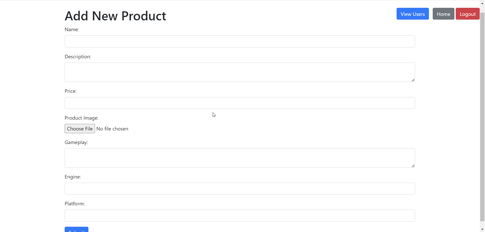

4. <a name= "obrab"> Обработка и добавление в базу данных продуктов `procces_product.php` </a>

4.1 Подключаем базу данных

```sql
require_once("./blocks/db.php");
```

4.2 Поверяем на заполнение всех полей 

```php
if (empty($_POST['name'])) {
    $errors['name'] = "Name is required";
}

if (empty($_POST['description'])) {
    $errors['description'] = "Description is required";
}

if (empty($_POST['price'])) {
    $errors['price'] = "Price is required";
}

if (empty($_FILES['icon']['name'])) {
    $errors['icon'] = "Product image is required";
}

if (!empty($errors)) {
    include 'add_product.php'; // Путь к странице добавления продукта
    exit;
}
```

4.3 Получаем и сохраняем добавленное изображение

```php
$target_dir = "uploads/";
$target_file = $target_dir . basename($_FILES["icon"]["name"]);
$imageFileType = strtolower(pathinfo($target_file, PATHINFO_EXTENSION));

// Перемещение файла из временной директории в указанную
if (move_uploaded_file($_FILES["icon"]["tmp_name"], $target_file)) {
    echo "The file " . htmlspecialchars(basename($_FILES["icon"]["name"])) . " has been uploaded.";
} else {
    echo "Sorry, there was an error uploading your file.";
}
```

4.4 Добавляем полученные данные в базу данных

```php
$name = $_POST['name'];
$description = $_POST['description'];
$price = $_POST['price'];
$icon = basename($_FILES["icon"]["name"]); // Здесь сохраняем только название файла
$gameplay = isset($_POST['gameplay']) ? $_POST['gameplay'] : '';
$engine = isset($_POST['engine']) ? $_POST['engine'] : '';
$platform = isset($_POST['platform']) ? $_POST['platform'] : '';

$sql = "INSERT INTO Product (Name, Description, Price, Icon, Gameplay, Engine, Platform) 
        VALUES ('$name', '$description', '$price', '$icon', '$gameplay', '$engine', '$platform')";

if ($conn->query($sql) === TRUE) {
    echo "New record created successfully";
} else {
    echo "Error: " . $sql . "<br>" . $conn->error;
}
```

5. <a name="temp"> Отображение продуктов `product_template.php` </a>

Для отображения продуктов я использовала скрипт

```php
    $sql = "SELECT * FROM Product WHERE ProductID = ?";
    $stmt = $conn->prepare($sql);
    $stmt->bind_param("i", $product_id);
    $stmt->execute();
    $result = $stmt->get_result();
    $row = $result->fetch_assoc();
```

в котором получаю данные о продукте из базы данных и вывожу их в нужных местах Html страницы.

```html
 <div class="price">Price $<?php echo number_format($row['Price'], 2); ?></div>
                    <div class="platform">Platform: <?php echo $row['Platform']; ?></div>
                    <div class="engine">Engine: <?php echo $row['Engine']; ?></div>
```

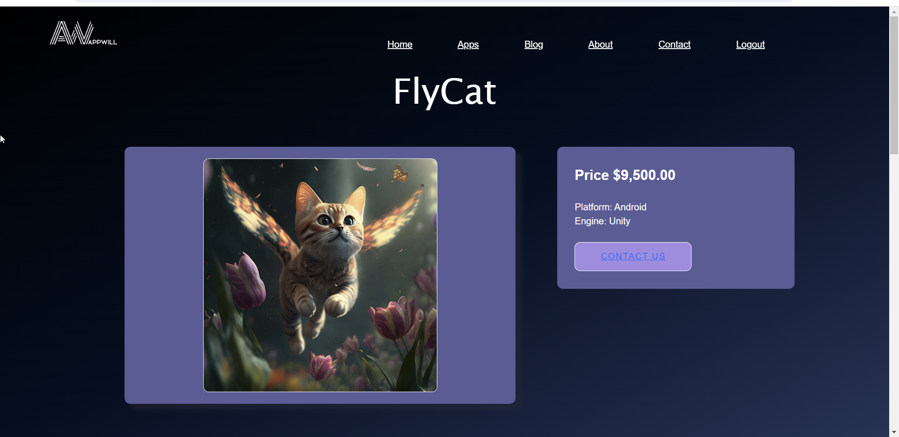

6. <a name="accounts" >Админ так же может посмотреть страницу всех зарегистрированных пользователей `accounts.php` </a>

6.1 Проверка имени пользователя и подключение базы данных

```php
session_start();

if (!isset($_SESSION['loggedin']) || $_SESSION['name'] !== 'admin') {
    // Если пользователь не администратор, перенаправляем его на index.php
    header('Location: index.php');
    exit;
}

require_once('./blocks/db.php');
```

6.2 Скрипт для вывода пользователей в виде таблицы 

```php
if ($result->num_rows > 0) {
            // Выводим данные каждого пользователя в таблицу
            while ($row = $result->fetch_assoc()) {
                echo "<tr>";
                echo "<td>" . $row["id"] . "</td>";
                echo "<td>" . $row["username"] . "</td>";
                echo "<td>" . $row["email"] . "</td>";
                echo "</tr>";
            }
        } else {
            // Если нет зарегистрированных пользователей, выводим сообщение
            echo "<tr><td colspan='3'>No registered users found</td></tr>";
        }
```

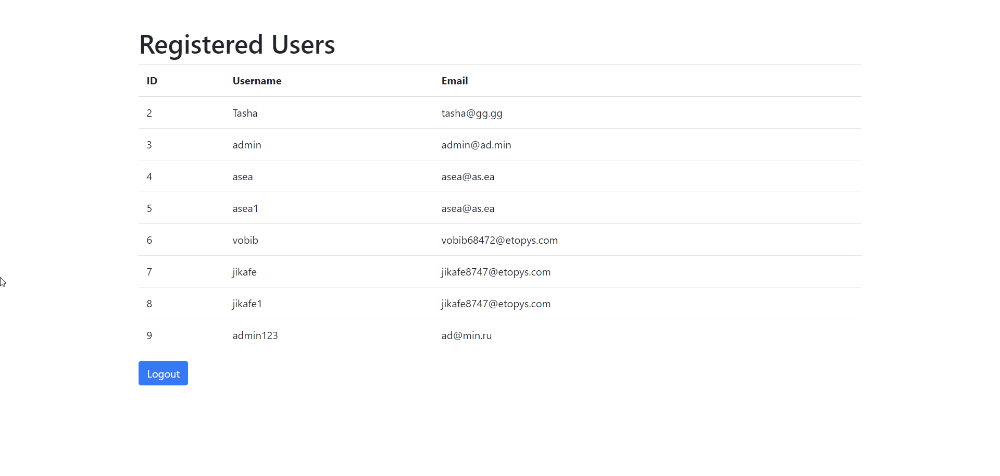

7. <a name="session"> Скрипт для завершения сессии </a>

```php
session_destroy();
header('Location: ../index.php');
```

8. <a name="reg"> Страница регистрации `register.php` </a>

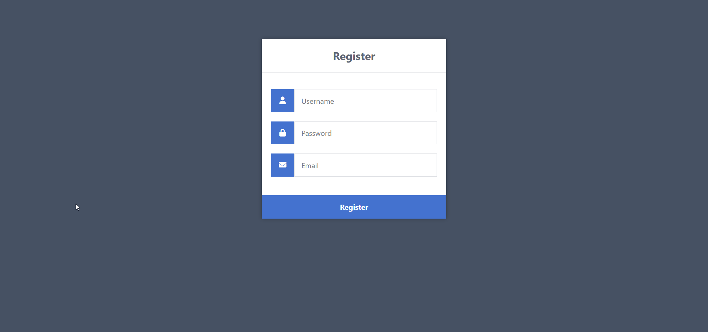

8.1 Проверка на заполнение полей и выполнения всех требований, требования прописаны при помощи регулярных выражений. Пароль должен состоять из 5-20 символов, использовать строчную и заглавную букву. В имени могут быть использованны только буквы и цифры. Почта поверяется встроенной функцией  `FILTER_VALIDATE_EMAIL`.

```php
if (!isset($_POST['username'], $_POST['password'], $_POST['email'])) {
    // Could not get the data that should have been sent.
    displayErrorPage('Please complete the registration form!');
    exit();
}

// Make sure the submitted registration values are not empty.
if (empty($_POST['username']) || empty($_POST['password']) || empty($_POST['email'])) {
    // One or more values are empty.
    displayErrorPage('Please complete the registration form!');
    exit();
}

if (!filter_var($_POST['email'], FILTER_VALIDATE_EMAIL)) {
    displayErrorPage('Email is not valid!');
    exit();
}

if (preg_match('/^[a-zA-Z0-9]+$/', $_POST['username']) == 0) {
    displayErrorPage('Username is not valid!');
    exit();
}

if (!preg_match('/^(?=.*[A-Z])(?=.*[0-9])(?=.*[!@#$%^&*()\-_=+{};:,<.>ยง~]).{5,20}$/', $_POST['password'])) {
    displayErrorPage("Password must contain at least one uppercase letter, one digit, and one special character, and be between 5 and 20 characters long!");
    exit();
}
```

Все ошибки выводятся в формате:


8.2 Если ошибок не наблюдается, то добавляем пользователя в базу данных

```php
// We need to check if the account with that username exists.
$stmt = $con->prepare('SELECT id FROM accounts WHERE username = ?');
if ($stmt) {
    // Bind parameters (s = string, i = int, b = blob, etc)
    $stmt->bind_param('s', $_POST['username']);
    $stmt->execute();
    $stmt->store_result();
    // Store the result so we can check if the account exists in the database.
    if ($stmt->num_rows > 0) {
        // Username already exists
        displayErrorPage('Username exists, please choose another!');
        exit();
    } else {
        // Username doesn't exists, insert new account
        $stmt = $con->prepare('INSERT INTO accounts (username, password, email, activation_code) VALUES (?, ?, ?, ?)');
        if ($stmt) {
            // We do not want to expose passwords in our database, so hash the password and use password_verify when a user logs in.
            $password = password_hash($_POST['password'], PASSWORD_DEFAULT);
            $uniqid = uniqid();
            $stmt->bind_param('ssss', $_POST['username'], $password, $_POST['email'], $uniqid);
            if ($stmt->execute()) {
                // Registration successful
                $_SESSION['loggedin'] = true;
                header('Location: ../index.php');
                exit();
            } else {
                // Registration failed
                displayErrorPage('Registration failed. Please try again later.');
                exit();
            }
        } else {
            // Something is wrong with the SQL statement
            displayErrorPage('Could not prepare statement!');
            exit();
        }
    }
    $stmt->close();
```

9. Авторизация пользователя `authorization.php`

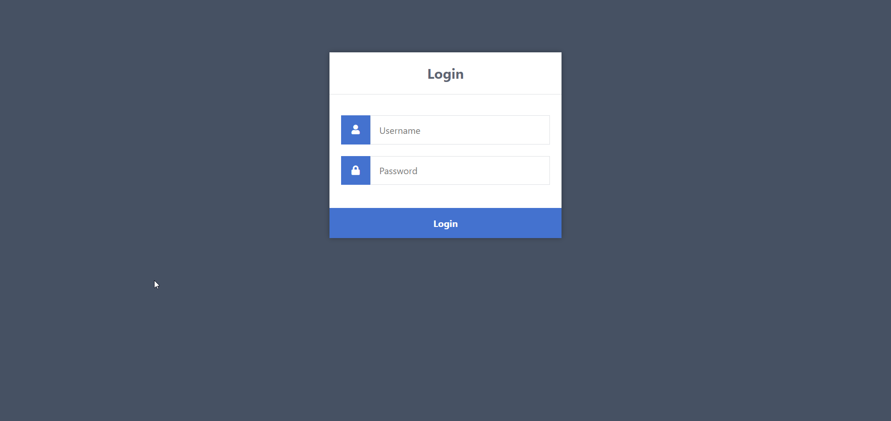

Проверяем существует лм пользователь с таким именем м паролем если это пользователь админ то перекидываем его на страницу добавления продукта, если любой другой то на главную страницу.

```php      
if ($stmt = $con->prepare('SELECT id, password FROM accounts WHERE username = ?')) {
    // Bind parameters (s = string, i = int, b = blob, etc), in our case the username is a string so we use "s"
    $stmt->bind_param('s', $_POST['username']);
    $stmt->execute();
    // Store the result so we can check if the account exists in the database.
    $stmt->store_result();
    if ($stmt->num_rows > 0) {
        $stmt->bind_result($id, $password);
        $stmt->fetch();
        if (password_verify($_POST['password'], $password)) {
            // Verification success! User has logged-in!
            // Create sessions, so we know the user is logged in, they basically act like cookies but remember the data on the server.
            session_regenerate_id();
            $_SESSION['loggedin'] = TRUE;
            $_SESSION['name'] = $_POST['username'];
            $_SESSION['id'] = $id;
            if ($_POST['username'] === 'admin' && $id === 3) {
                // If the user is admin, redirect to addproduct.php
                header('Location: ../addproduct.php');
                exit;
            } else {
                // For other users, redirect to index.php
                header('Location: ../index.php');
                exit;
            }
        } else {
            displayErrorPage('Incorrect password!');
            exit();
        }
    } else {
        displayErrorPage('Incorrect username!');
        exit();
    }

    $stmt->close();
}
```

10. Магазин где отображаютяс все продукты `shop.php`

10.1 подключаем базу данных и выбираем все продукты 

```php
$sql = "SELECT * FROM Product";
$result = $conn->query($sql);
?>
```

10.2 Отображаем все продукты из таблицы на сайте 

```php
  if ($result->num_rows > 0) {
                // Вывод иконок продуктов с краткой информацией
                $counter = 0;
                while ($row = $result->fetch_assoc()) {
                    echo '<div class="product-card">';
                    echo '<a href="product_template.php?id=' . $row['ProductID'] . '"></a>';
                    echo '<p><strong>' . $row['Name'] . '</strong></p>';
                    echo '<p>$' . number_format($row['Price'], 2) . '</p>';
                    echo '</div>';
                    // После каждого 5-го элемента добавляем пустой блок для выравнивания
                    $counter++;
                    if ($counter % 5 == 0) {
                        echo '<div style="flex-basis: 100%;"></div>';
                    }
                }
            } else {
                echo "No products to display.";
            }
```

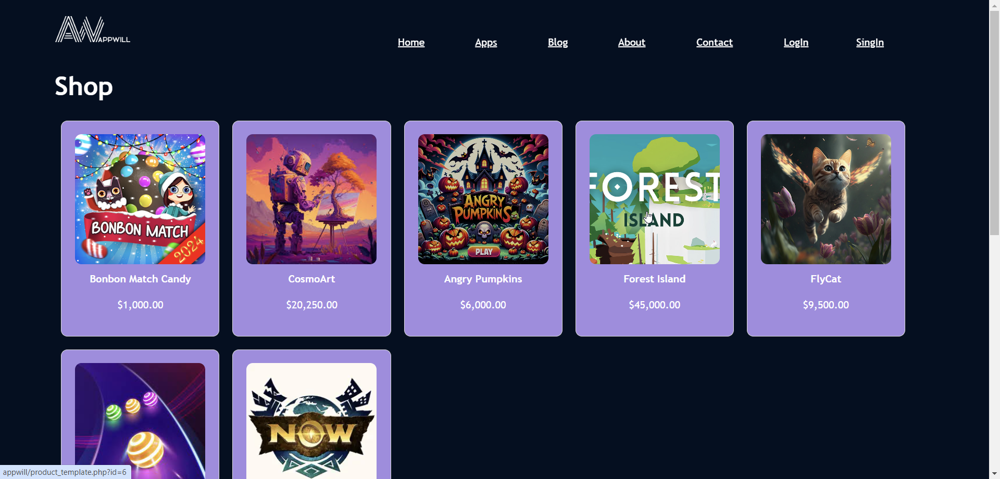

11. Поиск по странице `searche_result.php`

Поиск происходит при помощи sql запроса, ищет совпадения в названии и в описании продуктов. Выводится в соответствии с прописанными стилями и html кода. 

```php
 if (isset($_GET['query'])) {
        $search_query = $_GET['query'];
        // SQL запрос для поиска совпадений по полям Name и Description
        $sql = "SELECT * FROM Product WHERE Name LIKE '%$search_query%' OR Description LIKE '%$search_query%'";
        $result = $conn->query($sql);

        if ($result->num_rows > 0) {
            // Вывод результатов поиска
            while ($row = $result->fetch_assoc()) {
                // Подсветка совпадений в полях Name и Description
                $name = str_ireplace($search_query, '<span class="highlight">' . $search_query . '</span>', $row['Name']);
                $description = str_ireplace($search_query, '<span class="highlight">' . $search_query . '</span>', $row['Description']);

                // Оборачиваем всю карточку в тег <a> и указываем ссылку на страницу продукта
                echo "<a href='product_template.php?id={$row['ProductID']}' class='product-card'>";
                echo "";
                echo "<div class='product-info'>";
                echo "<p><strong>{$name}</strong></p>";
                echo "<p>Price: $" . number_format($row['Price'], 2) . "</p>";
                echo "<p>Platform: {$row['Platform']}</p>";
                echo "<p>Engine: {$row['Engine']}</p>";
                echo "<p>Description: {$description}</p>";
                echo "</div>";
                echo "</a>";
            }
        } else {
            echo "No results found.";
        }
    }
    $conn->close();
    ?>
```

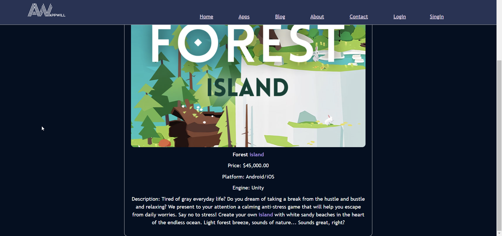

### <a name="istocniki"> Источники </a>

 - [codeshack](https://codeshack.io/secure-login-system-php-mysql/)

 - [youtube](https://www.youtube.com/)

- [chat](https://chat.openai.com/)

 - [coolors](https://coolors.co/)    

 - [candyfairytales](https://play.google.com/store/apps/details?id=com.gamesio.candyfairytales&hl=en_US)    

и другие 

## ***Вывод:**

В данном проекте была реализована работа с базой данных, сессиями, функциями и др. Для выполнения данной работя я мспользовала HTML, PHP, JS, CSS.
